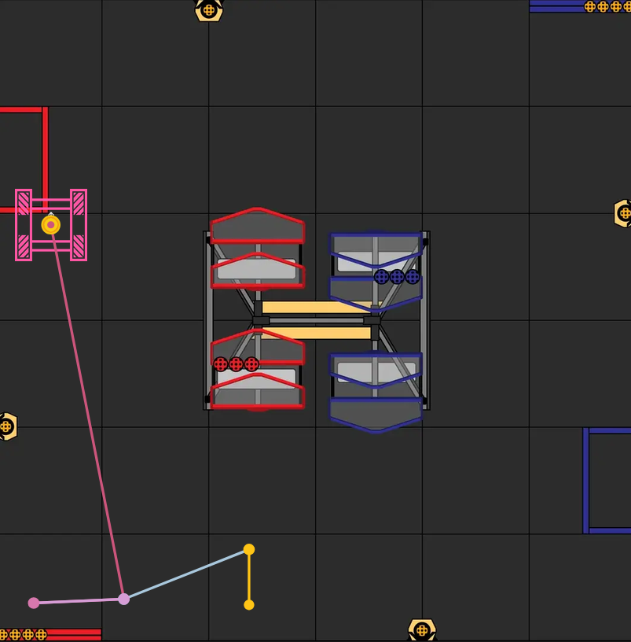
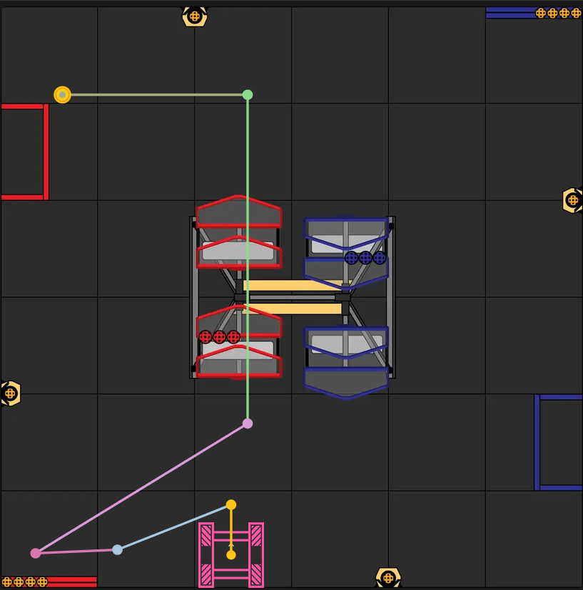
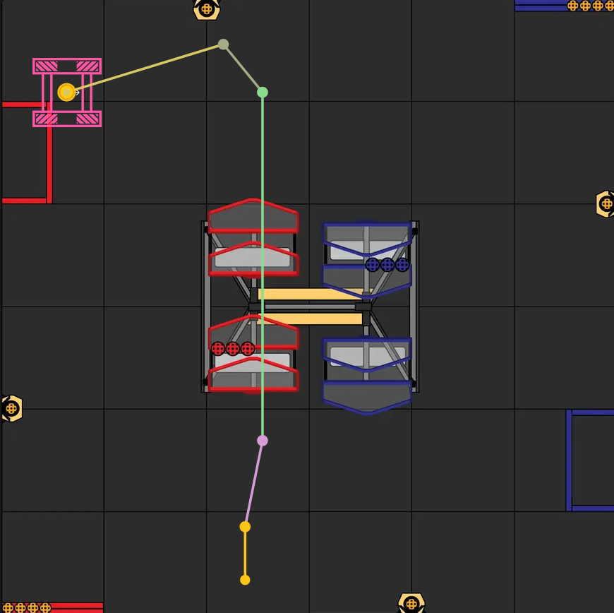
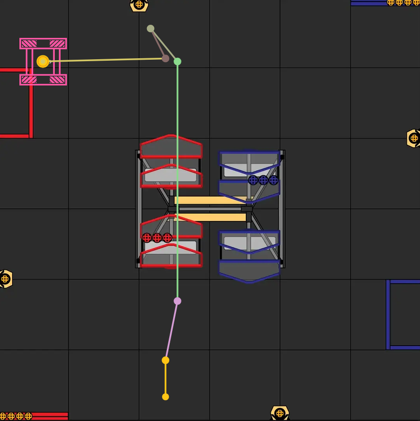

# Auto Pathing

# Comp 1 Strategies

### 1 Cycle + Garden + Park

Partner launches preload after first tip, then they park on left (top) side of loading zone. We launch preload first, collect garden pollen, then park in right (bottom) side of loading zone. Auto period ends with 1 total tip and 4 (or however many made in by alliance partner) balls in hive.

[red_1cycle_park.pp](./autoPP/red_1cycle_park.pp)

### 2 Cycles (Garden) + Park

Partner launches preload after first tip, then they park on right (bottom) side of loading zone. We launch preload first, collect garden pollen, then launch collected pollen on other side, then park in left (top) side of loading zone. Auto period ends with 2 total tips and empty hives.

[red_2cycle_park.pp](./autoPP/red_2cycle_park.pp)

### 1 Cycle + Flower + Park

Partner launches preload after first tip, then they park on right (bottom) side of loading zone. We launch preload first, collect pollen from flower opposite to starting side, then park in left (top) side of loading zone. Auto period ends with 1 total tip and 4 (or however many made in by alliance partner) balls in hive.

[red_1cycle_flower_park.pp](./autoPP/red_1cycle_flower_park.pp)

### 2 Cycles (Flower) + Park

Partner launches preload after first tip, then they park on right (bottom) side of loading zone. We launch preload first, collect pollen from flower opposite to starting side, then launch collected pollen, then park in top (left) side of loading zone. Auto period ends with 2 total tips and empty hives.

[red_2cycle_flower_park.pp](./autoPP/red_2cycle_flower_park.pp)

